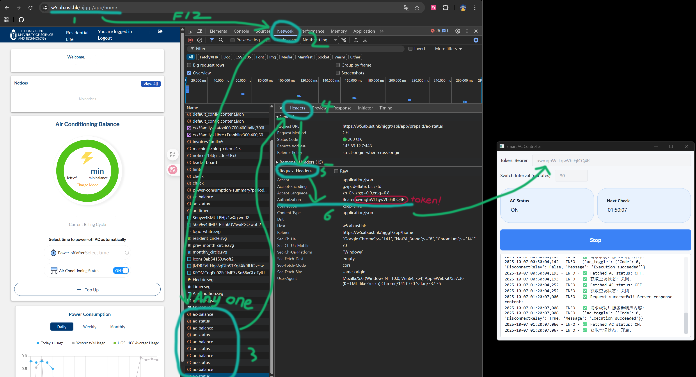

# HKUST AC Controller❄️

**Save money on your dorm AC by automatically cycling it on and off during the night time.**

**夜间自动循环开关空调，节省宿舍电费。**

---

## 💡 What It Does | 功能说明

**English:**  
HKUST accommodation charges AC fee by the time instead of power consumed.
This tool automatically switches your AC on and off at regular intervals, keeping your room cool while significantly reducing costs.

**中文：**  
科大宿舍空调按时间而不是电量计费。本工具自动循环开关空调，保持房间凉爽的同时，使电费电费减半。

---

## 🚀 Quick Start | 快速开始

### Option 1: Download Executable (Recommended) | 下载可执行文件（推荐）

**English:**
1. Download `HKUST_AC_Controller.exe` from the [Releases](https://github.com/Nook001/HKUST_AC_CONTROLLER/releases/tag/1.0.0) page
2. Double-click to run
3. Fill in your Token(see the tutorial below) and start it

**中文：**
1. 从 [Releases](https://github.com/Nook001/HKUST_AC_CONTROLLER/releases/tag/1.0.0) 页面下载 `HKUST_AC_Controller.exe`
2. 双击运行
3. 填入Token(按下方教程获取)并运行

### Option 2: Run from Source | 从源码运行

**English:**
```bash
git clone https://github.com/Nook001/HKUST_AC_CONTROLLER.git
cd HKUST_AC_CONTROLLER
pip install -r requirements.txt
python main.py
```

---

## 📖 How to Use | 使用方法

### Step 1: Get Your Token | 获取 Token

**English:**
1. Log in to [HKUST AC Control Website](https://w5.ab.ust.hk/njggt/app/home)
2. Press `F12` to open Developer Tools
3. Go to the **Network** tab
4. Refresh the page (press `F5`)
5. Click any request like `ac-status` or `ac-balance`
6. In the **Headers** tab, find `Authorization`
7. Copy the token **after** `Bearer ` (don't include "Bearer ")

**中文：**
1. 登录 [科大空调控制网站](https://w5.ab.ust.hk/njggt/app/home)
2. 按 `F12` 打开开发者工具
3. 切换到 **Network（网络）** 标签
4. 刷新页面（按 `F5`）
5. 点击任意请求，如 `ac-status` 或 `ac-balance`
6. 在 **Headers（请求头）** 中找到 `Authorization`
7. 复制 `Bearer ` **后面**的 token（不要复制 "Bearer "）




### Step 2: Configure and Start | 配置并启动

**English:**
1. Paste your token into the application
2. Set your desired interval (default: 30 minutes)
3. Click **Start**
4. The program will automatically cycle your AC

**中文：**
1. 将 token 粘贴到应用中
2. 设置开关间隔时间（默认：30 分钟）
3. 点击 **Start（开始）**
4. 程序将自动循环开关空调

4. 程序将自动循环开关空调

---

## ⚙️ Settings | 设置说明

**English:**
- **Token**: Your authorization key (keep it private!)
- **Switch Interval**: How often to toggle AC on/off (in minutes)
- **Status Display**: Shows current AC state (ON/OFF)
- **Next Check**: Shows when the next toggle will happen
- **Log Area**: View all operations in real-time

**中文：**
- **Token（令牌）**：您的授权密钥（请妥善保管！）
- **Switch Interval（切换间隔）**：空调开关间隔时间（单位：分钟）
- **Status Display（状态显示）**：显示当前空调状态（开/关）
- **Next Check（下次检查）**：显示下次切换的时间
- **Log Area（日志区域）**：实时查看所有操作记录

---

## 💰 How Much Can You Save? | 能省多少钱？

**English:**  
Running AC continuously: **~$200 HKD/month**  
Using this controller: **~$100 HKD/month**  
**Savings: ~$100 HKD/month or $1,200 HKD/year(suppose we have student from North/South Pole that uses AC even in the winter)!**

**中文：**  
持续启动空调：**约 200 港币/月**  
使用控制器：**约 100 港币/月**  
**节省：每月约 100 港币，每年约 1,200 港币！**

---

## ⚠️ Important Notes | 重要提示

**English:**
- Keep your computer running for the program to work
- Your token expires periodically—re-login to get a new one
- Use responsibly and comply with HKUST accommodation policies
- The program must stay open to continue cycling

**中文：**
- 程序运行期间请保持电脑开机
- Token 会定期过期，需重新登录获取
- 请合理使用，遵守科大宿舍管理规定
- 程序需要保持打开状态才能继续工作

---

## 🐛 Troubleshooting | 故障排除

### AC not switching? | 空调没有切换？

**English:**
- Check if your token is valid (log in again if needed)
- Verify your internet connection (don't use **VPN**)
- Check the log area for error messages

**中文：**
- 检查 Token 是否有效（如需要请重新登录）
- 确认网络连接正常 (不要使用VPN)
- 查看日志区域的错误信息

### Program crashes on start? | 程序启动就崩溃？

**English:**
- Make sure you're running the latest version
- Try running as administrator
- Check if antivirus is blocking it

**中文：**
- 确保使用最新版本
- 尝试以管理员身份运行
- 检查杀毒软件是否拦截

---

## 📞 Support | 技术支持

**English:**  
If you encounter any issues, please [open an issue](https://github.com/Nook001/HKUST_AC_CONTROLLER/issues) on GitHub. 

**中文：**  
如遇到问题，请在 GitHub 上[提交 issue](https://github.com/Nook001/HKUST_AC_CONTROLLER/issues)。

---

## 📄 License | 许可证

This project is licensed under the MIT License.

---

## ⭐ Enjoy Your Cool Room & Lower Bills! | 享受凉爽房间和更低账单！

**Made with ❤️ by HKUST students, for HKUST students**

**由科大学生制作，为科大学生服务**